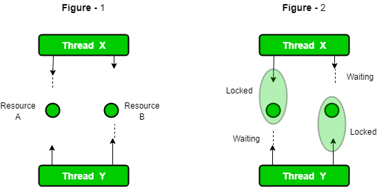

**Deadlock** occurs in Java when multiple threads block each other while waiting for locks held by one another. To prevent deadlocks, we can use the synchronized keyword to make methods or blocks thread-safe which means only one thread can have the lock of the synchronized method and use it, other threads have to wait till the lock releases other one acquires the lock

// Utility class to pause thread execution
class Util { 
    static void sleep(long millis)
    {
        try {
            Thread.sleep(millis);
        }
        catch (InterruptedException e) {
            e.printStackTrace();
        }
    }
}
// this class is shared by both threads
class Shared {
  
    // first synchronized method
    synchronized void test1(Shared s2)
    {
        System.out.println(Thread.currentThread().getName()
                           + " enters test1 of " + this);
        Util.sleep(1000);
      
        // Trying to call test2 
        // on another object
        s2.test2();
        System.out.println(Thread.currentThread().getName()
                           + " exits test1 of " + this);
    }
  
    // Second synchronized method
    synchronized void test2()
    {
        System.out.println(Thread.currentThread().getName()
                           + " enters test2 of " + this);
        Util.sleep(1000);
      
        // taking object lock of s1 enters
        // into test1 method
        System.out.println(Thread.currentThread().getName()
                           + " exits test2 of " + this);
    }
}

class Thread1 extends Thread {
    private Shared s1;
    private Shared s2;
  
    // constructor to initialize fields
    public Thread1(Shared s1, Shared s2)
    {
        this.s1 = s1;
        this.s2 = s2;
    }
  
    // run method to start a thread
    @Override public void run() { s1.test1(s2); }
}

class Thread2 extends Thread {
    private Shared s1;
    private Shared s2;
  
    // constructor to initialize fields
    public Thread2(Shared s1, Shared s2)
    {
        this.s1 = s1;
        this.s2 = s2;
    }
  
    // run method to start a thread
    @Override public void run() { s2.test1(s1); }
}
public class Geeks {
  
  // In this class deadlock occurs
    public static void main(String[] args)
    {
        // creating one object
        Shared s1 = new Shared();
        Shared s2 = new Shared();
      
        // creating first thread and starting it
        Thread1 t1 = new Thread1(s1, s2);
        t1.setName("Thread1");
        t1.start();
      
        // creating second thread and starting it
        Thread2 t2 = new Thread2(s1, s2);
        t2.setName("Thread2");
        t2.start();
        Util.sleep(2000);
    }
}

Locks in Java
Below is the diagrammatic representation of how Locks work and prevent Deadlock conditions.

Java-Locks

Detectecting Deadlocks
We can detect deadlocks in a running Java program using the following steps:

1. List the active Java processes:

jps -l

jcmd <PID> Thread.print          // replace PID with the process ID 

Replace <PID> with the process ID from the list provided by jps -l. This command outputs the state of the threads, which you can then analyze for deadlocks.

Preventing Deadlocks
We can avoid deadlock conditions by knowing its possibilities. It's a very complex process and not easy to catch. Still, if we try, we can avoid this. There are some methods by which we can avoid this condition. We can't completely remove its possibility but we can reduce it.

Avoid Nested Locks: This is the main reason for deadlock. Mainly happens when we give locks to multiple threads. Avoid giving lock to multiple threads if we already have given to one.
Avoid Unnecessary Locks: We should have lock only those members who are required. Having a lock on unnecessarily can lead to deadlock.
Using thread join: Deadlock condition appears when one thread is waiting for the other to finish. If this condition occurs we can use Thread. Join the with the maximum time you think the execution will take.