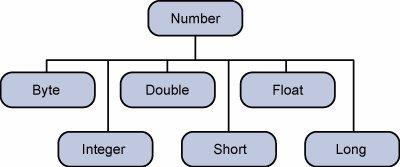

# Java Basic questions.
# Java Basic questions.

# 1. JDK, JVM, JRE, JIT

    =>
    1. JDK: Java Development Kit, used to develop java applications, writing and compiling code.
    2. JVM: Java virutal Machine, executes java bytecode, it convert bytecode into native machine code.
    3. JRE: Java runtime environment, used to run java app.
    4. JIT: Just in time compiler: a program that turns bytecode into instructions that can be sent directly to a computers processor.

# 2. Different types of memory areas allocated by JVM?

    =>
    1. Method Area / MetaSpace: Class metadata, static vars, constant pool (not thread specific).
    2. Heap: Object instances, arrays
    3. Stack: Method calls frames, local vars
    4. PC Register: current instruction address.
    5. Native Method Stack: For native method calls.
    6. Code Cache: JIT-compiled native code.

# Java, modifiers like public and static must follow a specific order in method declarations.

    =>
    [access modifier] [non-access modifier] [return type] [method name]

# Local variables:

    =>
    1. A variable declared inside a method, constructor, or block.
    2. Its scope is limited to the method/block in which it is declared.
    Example:
    public class Main {
        static int x;
    public static void main(String[] args) {
      int y;
      System.out.println(x);        //0
      System.out.println(y);        //error
      System.out.println("Hello, World!");
    }
    }

# Let say, we run a java class without passing any arguments. What will be the value of String array of arguments in Main method?

    =>
    if you run a java class without passing any arguments, then:
    String[] args in the main method will be:
    args.length == 0.
    1. It will not be null.
    2. it will be an empty array of the type String[].

    example:
    public class Test {
    public static void main(String[] args) {
        if (args.length == 0) {
            System.out.println("No arguments passed.");
        } else {
            for (String arg : args) {
                System.out.println(arg);
            }
        }
        }
    }

# What is the difference between byte and char data types in Java?

    =>
    1. byte: it is signed (can represent -ve and +ve values)
    2. char: it is unsigned(only +ve values, as it represents unicode chars).

# What is a blank final variable in Java? 76. How can we initialize a blank final variable? 77. Is it allowed to declare main method as final?

    =>   A blank final variable is a final variable that is declared but not initialized at the point of declaration.
    => it must be inititalized later, either in: The constructor, or in a static block, or instance initialize block.
    # Example:
    #Note: once final variable is initialized it won't change.
    class Demo{
        final int x;
        Demo(int value){
            x=value;
        }
    }

    => The JVM doesn't require main() to be overrideable — so marking it final has no effect on execution.
    => It prevents subclasses from overriding main() — though that's rarely necessary.

# What is package, and java.lang package?

    => java.lang package is the default package in java, it contains fundamental classes that are automatically imported in every java program.
    # Common classes in java.lang: Object, String, Math, System etc.

# Which is the most important class in Java?

    => java.lang.Object, b/c every class in java implicitly extends Object, either directly or indirectly.

# What is a static import in Java?

    => it allows you to access static members of a class without qualifying them with class name.
    Example:
        => import static package.ClassName.staticMember;

# What is the difference between import static com.test.Fooclass and import com.test.Fooclass?

    => import com.test.Fooclass: Allows you to create objects or call methods using FooClass.
    => import static com.test.Fooclass: Allows direct access to static fields or methods without class qualification.

# What is Locale in Java? How will you use a specific Locale in Java?

    => a Locale is an object that represents a specific geographical, political or cultural region.
    # Example:
    import java.text.NumberFormat;
    import java.util.Locale;
    public class Demo{
        public static void main(String[] args){
            double amount=123456.78;
            NumberFormat usFormat=NumberFormat.getCurrencyInstance(Locale.US);
            System.out.println("us:"+usFormat.format(amount));
        }
    }

# What is the serialization?

    => serialization in java is the process of converting an object into a byte stream so that it can be "stored to a file", "sent over a network" etc.
    => it allows java objects to be written to disk or transmitted, and then reconstructed (deserialized) later.
    # Example:
    import java.io.*;
    class Student implements Serializable{
        private static final long serialVersionUID=1L;
        int id;
        String name;
        Student (int id, String name){
            this.id=id;
            this.name=name;
        }
    }
    import java.io.FileOutputStream;
    import java.io.ObjectOutputStream;
    import java.io.IOException;

    public class SerializeExample {
        public static void main(String[] args) {
            Student student = new Student(101, "Alice", "secret123");

            try {
                FileOutputStream fileOut = new FileOutputStream("student.ser");
                ObjectOutputStream out = new ObjectOutputStream(fileOut);
                out.writeObject(student);
                out.close();
                fileOut.close();
                System.out.println("✅ Object serialized to student.ser");
            } catch (IOException e) {
                e.printStackTrace();
            }
        }
    }

    =>
    # Use Cases of Serialization:
        1. Saving objects to a file or database
        2. Sending objects over a network (e.g., in RMI or socket programming)
        3. Deep copying objects
        4. Java EE/Servlet sessions

# Deserialization:

    Deserialization is the reverse process — converting a byte stream back into a Java object.

    =>
    import java.io.FileInputStream;
    import java.io.ObjectInputStream;
    import java.io.IOException;

    public class DeserializeExample {
        public static void main(String[] args) {
            Student student = null;

            try {
                FileInputStream fileIn = new FileInputStream("student.ser");
                ObjectInputStream in = new ObjectInputStream(fileIn);
                student = (Student) in.readObject();
                in.close();
                fileIn.close();
            } catch (IOException | ClassNotFoundException e) {
                e.printStackTrace();
            }

            System.out.println("✅ Object deserialized:");
            student.display();  // Password will be null (transient)
        }
    }

# What is Serialization and Deserialization conceptually? Why do we mark a data member transient? Is it allowed to mark a method as transient? How does marking a field as transient makes it possible to serialize an

    => transient: transient keyword in java is used to tell the JVM to skip a field during serialization.
    Mark a field, if it contains.
    1. sensitive data
    2. cannot be serialized(e.g, file streams, thread, socket)
    # Methods cannot be mark as transient.
    # field marked as transient, excludes them from serialization process.

    # Example:
    class Worker implements Serializable{
        int id;
        transient Thread thread;
        Worker(){
            thread=new thread();
        }
    }

# What is Externalizable interface in Java?

    => its sub-interface of Serializable that gives the programmer full control over the serialization and deserialization process.

    =>
    With Serializable, Java handles serialization automatically.
    With Externalizable, you write the code to read/write object state using:

    writeExternal(ObjectOutput out)
    readExternal(ObjectInput in)
    #
    public interface Externalizable extends Serializable {
    void writeExternal(ObjectOutput out) throws IOException;
    void readExternal(ObjectInput in) throws IOException, ClassNotFoundException;
    }
    #
    public interface Externalizable extends Serializable {
    void writeExternal(ObjectOutput out) throws IOException;
    void readExternal(ObjectInput in) throws IOException, ClassNotFoundException;
    }

# What is Reflection in Java? What are the uses of Reflection in Java?

    => Reflection, it allows a java program to inspect and manipulate classes, methods, fields, and constructors at runtime.
    # How reflection works?: it relies on the Class object -> which represents the struture of a class.
    # we can use reflection to:
    1. Load a class dynamically.
    2. Get information about fields, methods and constructors etc.
    # Example:

    import java.lang.reflect.*;
    public class ReflectionDemo {
        public static void main(String[] args) throws Exception {
            // Load class at runtime
            Class<?> cls = Class.forName("java.lang.String");

            // Get class name
            System.out.println("Class Name: " + cls.getName());

            // List all methods
            Method[] methods = cls.getDeclaredMethods();
            for (Method m : methods) {
                System.out.println("Method: " + m.getName());
            }
        }
    }
    # Uses of Reflection in java?
    1. Dynamic Class Loading.
    2. Inspecting class Details.
    etc.

# How can we access private method of a class from outside the class?

    => through Reflection API, by using the setAccessible(true) method.

# How can we create an Object dynamically at Runtime in Java?

    => we can create an object dynamically at runtime using the Reflection API, specifically via the Class class and its methods like:
    Class.forName("ClassName")
    Class.newInstance() (deprecated)
    Constructor.newInstance()

    # Example:
    public class Animal{
        public void speak(){
            System.out.println("The animal speaks");
        }
    }

    # Using Class.forName()+newInstance().
    public class DynamicObjectExample{
        public static void main(String[] args){
            Class<?> clazz=Class.forName("Animal");
            Object obj=clazz.getDeclaredConstructor().newInstance();
            Animal animal=(Animal) obj;
            animal.speak();
        }
    }

    # Using constructor:
    public static void main(String[] args){
        Class<?> clazz=Class.forName("Animal");
        Object obj=clazz.getDeclaredConstructor().newInstance();
        //Cast and use.
        Animal animal=(Animal) obj;
        animal.speak();
    }

# What is Garbage Collection in Java?

    => Garbage collection: it is the process by which the JVM automatically reclaims memory used by objects that are no longer reachable or needed by the program.
    => when objects are created using new, they are stored in heap memory. If there are no references pointing to an object, it becomes eligible for garbage collection.
    => garbage collector detects these unreferenced objects and remove them to free up memory.

# Why do we use finalize() method in Java?

    =>
    finalize() method in java was originally intended to allow an object to perform cleanup operation before it gets garbage collection.

    public class FinalizeExample{
        @Override
        protected void finalize() throws Throwable{
            System.out.println("finalize called");
        }
        public static void main(String[] args){
            FinalizeExample obj=new FinalizeExample();
            obj=null;
            System.gc()
        }
    }

# What are the different types of References in Java?

    =>
    1. Strong Reference(default)
    2. Soft Reference(java.lang.ref.SoftReference<T>): used for implementing memory-sensitive caches, Object is only collected when JVM is low on memory.
    #Example:
        SoftReference<String> softRef = new SoftReference<>(new String("Data"));
    3. Weak Reference(java.lang.ref.WeakReference<T>)
    4. Phantom Reference(java.lang.ref.PhantomReference<T>)

# How can we reference an unreferenced object again?

    => An object is unreferenced when: all references to it are set to null, or the reference variables go out of scope.
    # Example:
    MyClass obj=new MyClass();
    obj=null;

# What kind of process is the Garbage collector thread?

    => its a low-priority, daemon thread that runs in the background as part of JVM's memory management system.

# What is the purpose of the Runtime class?

    => Runtime class in java provides a direct interface to the JVM, it allows you to interact with and control JVM environment at runtime.
    Example:
    Runtime runtime=Runtime.getRuntime();
    public class RuntimeMemory {
        public static void main(String[] args) {
            Runtime rt = Runtime.getRuntime();
            System.out.println("Total Memory: " + rt.totalMemory());
            System.out.println("Free Memory: " + rt.freeMemory());
            System.out.println("Max Memory: " + rt.maxMemory());
        }
    }

# How can we invoke an external process in Java?

    => you can invoke an external process or command-line program using: Runtime.exec()

    import java.io.*;

    public class RuntimeExample {
        public static void main(String[] args) throws IOException {
            Process process = Runtime.getRuntime().exec("notepad"); // Windows only
        }
    }

# How Many Objects Does the Following Code Create?

    =>
    Let's consider this common example:

    String s1 = "Hello";    //creates one string object in the string pool, if "Hello" exist there, if it already exists in the pool, no new object is created.

    String s2 = new String("Hello");    //always creates a new object in heap, even if "Hello" already exists in the pool.

# How many ways are there in Java to create a String object?

    => 2 main ways, but can be created in several ways.
    Example:
    String s1="Hello";
    String s2=new String("hello");

# What is String interning?

    => String interning, it refers to the process of storing only one copy of each distinct string value in a special memory area called the string constant pool (or string intern pool).

    # When to Avoid It
    1. Interning too many unique strings (like user input) can bloat the pool and lead to memory issues.
    2. Only use interning when you expect many repeated string values.

# Why Java uses String literal concept?

    => optimize memory usage, improve performance, and ensure efficient reuse of identical string values.

# What is annotations in java?
    =>
    these are a form of metadata that provide data about a program but not part of the program itself. They have no direct effect on the code they annotate but can be used by compiler, development tools, or during runtime via reflection.

# What are Annotations?
    =>
    1. Metadata: Information about the code such as classes, methods, variables, parameters, etc.
    2. Syntax: Denoted by @ followed by the annotation name, e.g., @Override.
    3. Purpose: Help with code analysis, generate boilerplate code, enforce compile-time checks, or influence runtime behavior.

# Common Uses of Annotations
    =>
    1.Compile-time checks: For example, @Override ensures a method overrides a method in a superclass.
    2. Code generation: Frameworks use annotations to generate code automatically.
    3. Runtime processing: Frameworks like Spring or Hibernate use annotations to configure beans or map database entities.

    Examples of Built-in Java Annotations
    @Override: Checks that a method is overriding a superclass method.

    @Deprecated: Marks a method or class as deprecated.

    @SuppressWarnings: Instructs the compiler to ignore certain warnings.

    @FunctionalInterface: Indicates an interface with exactly one abstract method.

# Custom Annotations
    =>
    You can also define your own annotations using @interface keyword.

    public @interface MyAnnotation {
        String value();
        int number() default 0;
    }

# What is yield in java?
    => 
    yield has 2 different meaning depending on the context;
    1. Thread.yeild():  method(Concurrency context)
        a. It's a static method in the Thread class.
        b. It hints to the thread scheduler that the current thread is willing to pause its execution to allow other threads of the same priority to run.
        c. It does not guarantee that the current thread will stop or that another thread will run immediately
        d. Useful for improving thread scheduling fairness but should be used carefully.

        # Example:
        ## Thread.yield():
        This tells the JVM: “I’m willing to give up my CPU time now if other threads need it.”
    
    2. yield keyword in java 14+(switch expressions)
        => 
        a. introduced as part of switch expression in java.
        b. Used to return a value from a switch expression.
        c. Allows switch to be used as an expression (returning a value) instead of a statement

# What is Number Class? 
    =>
    The Number class is an abstract class in java.lang package. It is the superclass of the classes that represent numeric values convertible to primitive data types such as byte, short, int, long, float and double.

