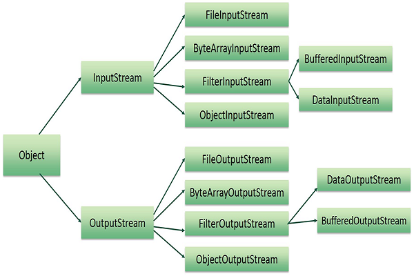

# File Handling questions

# We can create a file in java using multiple ways, Following are 3 most popular ways.
    1. FileOutputStream() constructor
    2. File.createNewFile() method
    3. Files.write()    method.

# We can write to a file in Java using multiple ways. Following are three most popular ways to create a file in Java −
    1. Using FileOutputStream() constructor
    2. Using FileWriter.write() method
    3. Using Files.write() method

# We can read a file in Java using multiple ways. Following are three most popular ways to create a file in Java −
    1. Using FileInputStream() constructor
    2. Using FileReader.read() method
    3. Using Files.readAllLines() method

# To delete a file in Java, you can use the File.delete() method. This method deletes the files or directory from the given path.

# Directory Operations:
    => A directory is a File which can contain a list of other files and directories. You use File object to create directories, 

# Java Files and I/O Streams:
    =>
    InPutStream :=> The InputStream is used to read data from a source.
    OutPutStream :=> The OutputStream is used to writing data to a destination.

# ByteStreams:
    => 
    byte stream are used to perfom i/o of 8-bytes

# Character Streams:
    =>
    Character streams are used to perform i/o for the 16-bit unicode.

